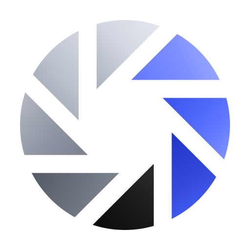
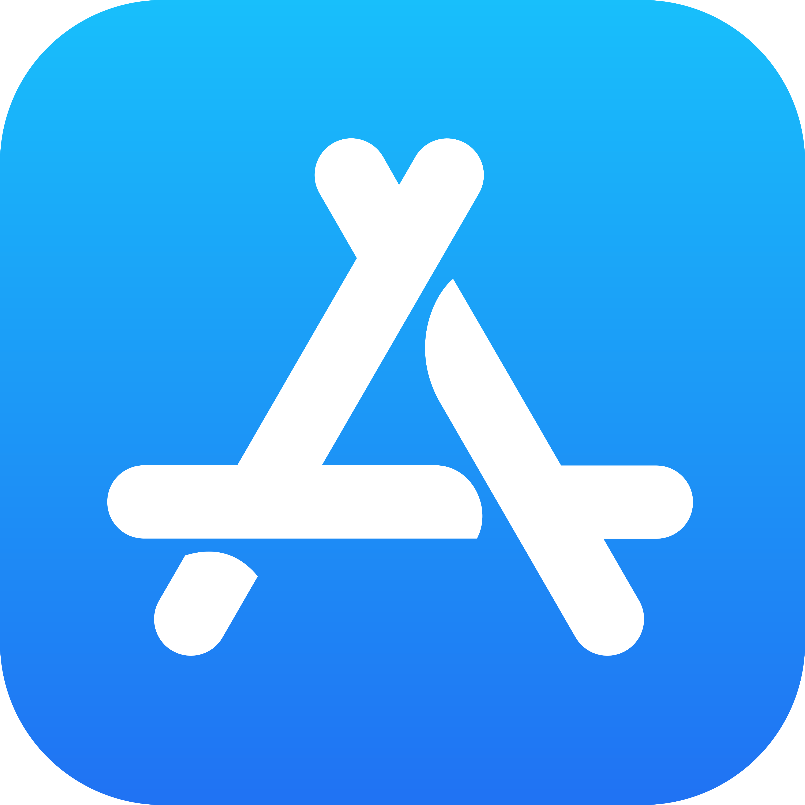

# PairShot iOS

**Before·After 촬영 및 관리 애플리케이션**

**[🌐 웹사이트 바로가기](https://pairshot.kangkyeonggu.com)** &nbsp;&nbsp; **[ 다운로드](https://apps.apple.com/kr/app/pairshot-%ED%8E%98%EC%96%B4%EC%83%B7-before-after/id6770494128)**

 

 

 

---

## 목차

- [개요](#개요)
- [기술 스택](#기술-스택)
- [주요 기능](#주요-기능)
- [릴리즈 노트](#릴리즈-노트)

---

## 개요

PairShot은 Before·After 사진 촬영·관리·합성·워터마크 삽입·내보내기 등 관리 편의기능을 제공하는 iOS 애플리케이션입니다. 각 Before·After 촬영본 페어를 자동으로 묶어 관리하며, 오버레이 가이드를 통한 손쉬운 After 촬영 지원, 합성·워터마크·압축파일 내보내기까지 전·후 사진 촬영에 필요한 전체 워크플로우를 제공합니다.

 

---

## 기술 스택

**`Core`**

**`Camera & Image`**

**`Data & DI`**

**`Sensors & Location`**

**`Build & Quality`**

 

---

## 주요 기능

### `01` · 촬영

<table>
<tr>
<td width="50%" valign="top">

#### 프로젝트 기반 촬영
생성한 각 프로젝트 별 Before·After 페어를 자동으로 분류합니다. After 사진 촬영 시 기존 Before 사진과의 자동 페어링 기능을 제공합니다.

</td>
<td width="50%" valign="top">

#### 오버레이 가이드
After 촬영 시 Before 사진을 반투명 오버레이로 뷰파인더에 표시합니다. 동일한 구도·앵글을 손쉽게 재현할 수 있습니다.

</td>
</tr>
</table>

 

---

### `02` · 관리 및 내보내기

<table>
<tr>
<td width="50%" valign="top">

#### 페어 카드 관리
프로젝트별 갤러리에서 Before·After 페어 카드를 관리할 수 있습니다. 비교 뷰 미리보기, 프로젝트 이름 변경·삭제 등 기본 관리 기능을 제공합니다.

</td>
<td width="50%" valign="top">

#### 이미지 합성
선택한 Before·After 페어 원본 비트맵을 합성하여 단일 비교 이미지를 생성합니다. 또한, 합성 이미지에 적용할 테두리 및 레이블 사용자 커스텀 설정을 지원합니다.

</td>
</tr>
<tr>
<td valign="top">

#### 워터마크 자동 삽입
이미지 텍스트·로고 워터마크 삽입 기능을 지원합니다. 텍스트·로고 설정, 위치·크기 커스터마이징을 통해 원하는 워터마크를 자유롭게 삽입할 수 있습니다.

</td>
<td valign="top">

#### 내보내기 및 공유
개별 이미지 갤러리 저장·압축 파일 생성 기능을 제공합니다. Before·After·합성본 원본 또는 워터마크 삽입 버전을 자유롭게 선택하여 기기, 메신저앱, 공유드라이브 등 원하는 곳으로 즉시 전송할 수 있습니다.

</td>
</tr>
</table>

 

---

## 릴리즈 노트

| 버전 | 날짜 | Build | 주요 내용 | 노트 |
|------|------|-------|-----------|------|
| [v1.2.0](docs/releases/v1.2.0.md) | 2026-05-30 | 1 | 내보내기 프리셋 4 슬롯 (무료 2 / Pro 4) · 페어 미리보기 액션 바·핀치 줌 패닝·After 삭제 개편 · 인앱 리뷰 prompt | [→](docs/releases/v1.2.0.md) |
| [v1.1.1](docs/releases/v1.1.1.md) | 2026-05-24 | 1 | 튜토리얼 안정화 (stuck 검출·peek-close·cold-start 복원) · Dynamic Type 앱 정책 · 카메라 재진입 프리뷰 멈춤 fix | [→](docs/releases/v1.1.1.md) |
| [v1.1.0](docs/releases/v1.1.0.md) | 2026-05-23 | 1 | 합성 설정 레이블 배치 방식(이미지/테두리) 신설 · AFTER long-press 미리보기 · ATT/UMP 정공화 | [→](docs/releases/v1.1.0.md) |
| [v1.0.0](docs/releases/v1.0.0.md) | 2026-05-19 | 1 | Before·After 페어 사진 촬영·관리·내보내기 첫 출시 | [→](docs/releases/v1.0.0.md) |

 

---

© 2026 NomadLabs. All rights reserved.

