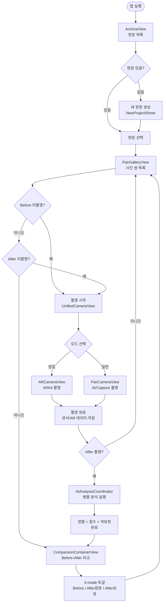
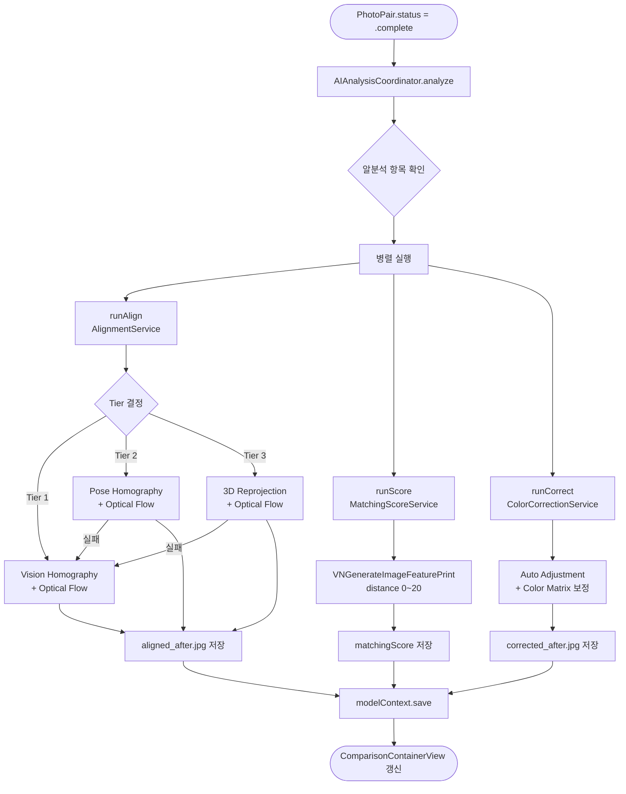

# PairShot — 설계 문서

현장 작업자를 위한 Before/After 사진 쌍 촬영·관리 iOS 앱.

---

## 목차

1. [앱 개요](#1-앱-개요)
2. [기기 등급별 센서 매트릭스](#2-기기-등급별-센서-매트릭스)
3. [데이터 모델](#3-데이터-모델)
4. [전체 기능 플로우](#4-전체-기능-플로우)
5. [컴포넌트 아키텍처](#5-컴포넌트-아키텍처)
6. [촬영 파이프라인](#6-촬영-파이프라인)
7. [AI 분석 파이프라인](#7-ai-분석-파이프라인)
8. [저장소 구조](#8-저장소-구조)
9. [UI 네비게이션 구조](#9-ui-네비게이션-구조)
10. [기능 라이프사이클](#10-기능-라이프사이클)

---

## 1. 앱 개요

### 핵심 목적

현장(건설·시설·인테리어 등)에서 **동일한 위치·앵글**로 Before/After를 촬영하여 비교·분석·보고하는 툴.

### 설계 원칙

| 원칙 | 내용 |
|------|------|
| **UX First** | 최소 탭, 직관적 가이드, 자동화 |
| **센서 레이어링** | 단일 센서 의존 없음 — 하드웨어에 따라 정밀도 자동 조정 |
| **로컬 전용** | 클라우드 업로드 없음, 기기 내 완결 |
| **저조도 자동** | 사용자 인지 없이 노출 최적화 |

### 지원 기기 범위

```
일반 iPhone (LiDAR 없음)
  └─ 카메라 추적 + 센서 가이드 (기본 정렬)

iPhone Pro 시리즈 (LiDAR 탑재)
  └─ 카메라 추적 + 센서 가이드 + LiDAR 깊이 보정 (정밀 정렬)
```

---

## 2. 기기 등급별 센서 매트릭스

### 2-A. 하드웨어 가용성

| 센서 / 기능 | 일반 iPhone | iPhone Pro (LiDAR) | 비고 |
|-------------|:-----------:|:-----------------:|------|
| 카메라 (AVFoundation) | ✅ | ✅ | 48MP, macro |
| ARKit (Visual-Inertial) | ✅ | ✅ | A12 이상 |
| LiDAR Depth Camera | ❌ | ✅ | iPhone 12 Pro 이상 |
| IMU (가속도계·자이로) | ✅ | ✅ | Core Motion |
| 자기계 (나침반) | ✅ | ✅ | CL heading |
| GPS / 고도 | ✅ | ✅ | Core Location |
| Core Haptics | ✅ (iPhone 8+) | ✅ | CHHapticEngine |
| High-Res Frame Capture | ✅ | ✅ | ARKit |
| Scene Depth (sceneDepth) | ❌ | ✅ | ARFrameSemantics |

### 2-B. 센서별 수집 데이터

| 센서 | 수집 데이터 | 업데이트 주기 | 저장 필드 |
|------|------------|-------------|----------|
| **ARKit VIO** | camera transform (4×4 matrix), tracking state, world mapping status | ~60fps → UI 30fps 스로틀 | `Photo.arTransformData` (64 bytes) |
| **ARKit Scene Depth** | depth map (Float32 pixelBuffer, W×H) | 프레임 단위 | `Photo.depthMapPath` |
| **ARKit Intrinsics** | fx, fy, cx, cy | 프레임 단위 | `Photo.arIntrinsicsData` (36 bytes) |
| **LiDAR (DepthCaptureService)** | center depth (m), focal length (px) | ~10fps | `Photo.depthAtCenter`, `Photo.focalLength` |
| **IMU (Core Motion)** | pitch, roll, yaw (radians, low-pass α=0.15) | ~50Hz | `Photo.pitch/roll/yaw` |
| **자기계** | magnetic heading (degrees) | ~10Hz | `Photo.heading` |
| **GPS** | latitude, longitude, altitude (m) | ~1Hz | `Photo.latitude/longitude/altitude` |
| **ARKit WorldMap** | 3D feature points + pose history | 촬영 시 snapshot | `Photo.worldMapPath` |

### 2-C. 기기별 정렬 Tier 결정 트리

```
촬영 완료 후 AlignmentService 실행
│
├─ worldMapRelocalized = false 또는 AR 데이터 없음
│  └─ Tier 1 (모든 기기)
│     └─ Vision Homography + Optical Flow
│
├─ worldMapRelocalized = true + pose 데이터 있음 + depth 없음
│  └─ Tier 2 (일반 iPhone, AR 재지역화 성공)
│     └─ Pose Homography (평면 근사) + Optical Flow
│
└─ worldMapRelocalized = true + pose 데이터 있음 + depth 있음
   └─ Tier 3 (iPhone Pro, LiDAR)
      └─ 3D Reprojection (depth + pose) + Optical Flow
         (실패 시 Tier 1 폴백)
```

---

## 3. 데이터 모델

### 3-A. 엔티티 관계도

```
Project ──────────────────────────────────────┐
│                                              │
│  id: UUID                                   │ 1
│  title: String                              │
│  createdAt: Date                            │ pairs (cascade delete)
│  latitude, longitude: Double?               │
│  completePairCount: Int (computed)          │ N
│  totalPairCount: Int (computed)             ▼
│  coverThumbnailPath: String? (computed)  PhotoPair
│                                              │
└──────────────────────────────────────────────│
                                               │  id: UUID
                                               │  status: PairStatus
                                               │  captureMode: CaptureMode
                                               │  matchingScore: Float?
                                               │  alignedAfterImagePath: String?
                                               │  colorCorrectedAfterImagePath: String?
                                               │  alignmentTierRaw: String?
                                               │
                                               │ beforePhoto (cascade)    afterPhoto (cascade)
                                               │      │                         │
                                               ▼      ▼                         ▼
                                             Photo                           Photo
                                               │
                                               │  id: UUID
                                               │  filePath: String
                                               │  thumbnailPath: String
                                               │  timestamp: Date
                                               │
                                               │  [위치]
                                               │  latitude, longitude: Double?
                                               │  altitude: Double?
                                               │
                                               │  [IMU 포즈]
                                               │  heading, pitch, roll, yaw: Double?
                                               │
                                               │  [AR 데이터]
                                               │  worldMapPath: String?
                                               │  arTransformData: Data?     ← simd_float4x4
                                               │  arIntrinsicsData: Data?    ← matrix_float3x3
                                               │  depthMapPath: String?
                                               │  depthAtCenter: Double?
                                               │  arRelocalized: Bool
                                               │
                                               │  [카메라 메타]
                                               │  focalLength, zoomFactor: Double?
                                               └─ notes: String?
```

### 3-B. Enum 정의

```
PairStatus
  .pendingAfter  — Before 완료, After 미촬영
  .complete      — Before + After 모두 완료, AI 분석 대기/완료

CaptureMode
  .precision     — ARKit 기반 정밀 촬영
  .normal        — AVCapture 기반 일반 촬영

QualityIssue
  .blurry        — 흐림 (Laplacian edge score 미달)
  .overExposed   — 과노출 (히스토그램 bright 60% 초과)
  .underExposed  — 저노출 (히스토그램 dark 70% 초과)

AlignmentTier (raw string)
  "tier1"        — Vision Homography + Optical Flow
  "tier2"        — Pose Homography + Optical Flow
  "tier3"        — 3D Reprojection + Optical Flow
  "failed"       — 정렬 실패
```

---

## 4. 전체 기능 플로우

### 4-A. 메인 사용자 여정



### 4-B. 정밀 촬영 (ARKit) 플로우

```mermaid
flowchart TD
    A([UnifiedCameraView\nmode = .precision]) --> B[ARCameraView 표시]
    B --> C[ARSession 시작\n.gravity 정렬]
    C --> D{isBefore?}

    D -- Before --> E[WorldMap 구성 중\n.limited → .mapped 대기]
    E --> F[촬영 버튼]
    F --> G[capturePhoto\nhigh-res ARFrame]
    G --> H[WorldMap 캡처\n.mapped/.extending]
    H --> I[WorldMap 저장\nworldmap.armap]
    I --> J[센서 스냅샷 저장\npitch/roll/yaw + arTransform + depth]
    J --> K[Photo 저장\n↓\nPhotoStorage]
    K --> L[PhotoPair.status\n= .pendingAfter]

    D -- After --> M[WorldMap 로드\n(beforePhoto.worldMapPath)]
    M --> N{로드 성공?}
    N -- 예 --> O[startSession\ninitialWorldMap 설정]
    O --> P[Relocalization\n.relocalizing]
    P --> Q{10s 내 성공?}
    Q -- 예 --> R[arRelocalized = true\nSixDOFGuide 활성화]
    Q -- 아니오 --> S[Tier 1 폴백\n(world map 없이 진행)]
    N -- 아니오 --> S
    R --> T[6DOF 가이드\n위치·각도 맞추기]
    T --> U{isFullyAligned?}
    U -- 예 --> V[✓ 완전 정렬 표시\n+ 진동 피드백]
    V --> F
    U -- 아니오 --> T
    S --> F
    F --> W[After 촬영\nARFrame + 센서]
    W --> X[AI 분석\nAIAnalysisCoordinator]
```

### 4-C. AI 분석 파이프라인 플로우



---

## 5. 컴포넌트 아키텍처

### 5-A. 레이어 구조

```
┌─────────────────────────────────────────────────────────────┐
│  UI Layer (SwiftUI Views)                                    │
│                                                              │
│  ArchiveView ──► PairGalleryView ──► UnifiedCameraView       │
│                                   └──► ComparisonView        │
│                                                              │
│  ARCameraView          PairCameraView                        │
│  ARCameraPreviewView   CameraPreviewView                     │
│  SixDOFGuideView       SensorGuideView                       │
│  GhostOverlayView      ZoomControlView                       │
├─────────────────────────────────────────────────────────────┤
│  Coordinator Layer                                           │
│                                                              │
│  AIAnalysisCoordinator                                       │
│  (정렬 / 점수 / 색보정 병렬 오케스트레이션)                     │
├─────────────────────────────────────────────────────────────┤
│  Service Layer (@Observable, @MainActor)                     │
│                                                              │
│  ARSessionManager        CameraManager                       │
│  PositionMatchingService  DepthCaptureService                │
│  QualityCheckService     LowLightManager                     │
│  SensorManager           HapticService                       │
│                                                              │
│  (nonisolated / async)                                       │
│  AlignmentService        MatchingScoreService                │
│  ColorCorrectionService  PhotoStorageService                 │
│  ImageProcessingContext                                      │
├─────────────────────────────────────────────────────────────┤
│  Data Layer (SwiftData)                                      │
│                                                              │
│  Project ──► PhotoPair ──► Photo (Before)                    │
│                        └──► Photo (After)                    │
├─────────────────────────────────────────────────────────────┤
│  Framework Layer                                             │
│                                                              │
│  ARKit · AVFoundation · Vision · CoreImage                   │
│  CoreMotion · CoreLocation · CoreHaptics                     │
│  SwiftData · PDFKit · ZIPFoundation                          │
└─────────────────────────────────────────────────────────────┘
```

### 5-B. 서비스 의존 관계

```
UnifiedCameraView
  ├── ARCameraView
  │     └── ARSessionManager
  │           ├── ARSession (ARKit)
  │           └── CIContext (ImageProcessingContext)
  │
  └── PairCameraView
        ├── CameraManager
        │     └── AVCaptureSession
        ├── SensorManager
        │     ├── CMMotionManager
        │     └── CLLocationManager
        ├── LowLightManager
        │     └── AVCaptureDevice (KVO)
        ├── DepthCaptureService
        │     └── AVCaptureDepthDataOutput
        ├── PositionMatchingService
        │     └── VNTranslationalImageRegistrationRequest
        ├── QualityCheckService
        │     └── CIContext
        └── HapticService
              └── CHHapticEngine

ComparisonContainerView
  └── AIAnalysisCoordinator
        ├── AlignmentService
        │     ├── VNHomographicImageRegistrationRequest
        │     ├── VNGenerateOpticalFlowRequest
        │     └── CIContext (shared)
        ├── MatchingScoreService
        │     └── VNGenerateImageFeaturePrintRequest
        └── ColorCorrectionService
              └── CIAutoAdjustmentFilters + CIColorMatrix
```

---

## 6. 촬영 파이프라인

### 6-A. 정밀 촬영 (ARKit) 데이터 수집

```
ARCameraView.handleCapture()
│
├─ 1. Tracking 대기 (최대 3초)
│     trackingState == .normal 확인
│
├─ 2. ARFrame 고해상도 캡처
│     arManager.capturePhoto()
│     └─ captureHighResolutionFrame → UIImage + simd_float4x4 + matrix_float3x3
│
├─ 3. 센서 스냅샷 수집
│     pitch, roll, yaw (CMMotion)
│
├─ 4. [Before만] WorldMap 저장
│     worldMappingStatus == .mapped/.extending → captureWorldMap()
│     → NSKeyedArchiver → worldmap.armap
│
├─ 5. [After만] Relocalization 결과 기록
│     arRelocalized = (didLoadWorldMap && trackingState == .normal)
│
├─ 6. LiDAR Depth Map 저장 (Pro만)
│     sceneDepthMap → {pairId}_before_depth_WxH.bin
│
└─ 7. Photo SwiftData 저장
      filePath, thumbnailPath, arTransformData,
      arIntrinsicsData, depthMapPath, arRelocalized, ...
```

### 6-B. 일반 촬영 (AVCapture) 데이터 수집

```
PairCameraView.handleCapture()
│
├─ 1. 품질 검사 (QualityCheckService)
│     CIAreaHistogram → 노출 판정
│     CIConvolution5X5 → 흐림 판정
│     문제 감지 시 경고 (사용자 확인 후 진행 가능)
│
├─ 2. 저조도 처리 (LowLightManager)
│     ISO 800+ → 자동 토치 활성화
│     ISO 1200+ → 노이즈 제거 필터 적용
│
├─ 3. 고해상도 촬영 (48MP)
│     AVCapturePhotoOutput.capturePhoto()
│     photoQualityPrioritization = .quality
│
├─ 4. 센서 스냅샷 수집 (SensorManager)
│     pitch, roll, yaw, heading, latitude, longitude, altitude
│
├─ 5. [LiDAR 기기만] 깊이 데이터 수집
│     DepthCaptureService.centerDepth
│     DepthCaptureService.focalLengthPixels
│
├─ 6. 썸네일 생성
│     max 320px 리사이즈 → JPEG → thumbs/{pairId}_{side}.jpg
│
└─ 7. Photo SwiftData 저장
```

### 6-C. 위치 정렬 가이드 시스템

```
정밀 모드 (ARCameraView)
  └─ SixDOFGuideView
       ├─ 좌우 (Lateral X): positionDelta.x × 100 cm
       ├─ 상하 (Height Y): positionDelta.y × 100 cm
       ├─ 전후 (Depth Z): positionDelta.z × 100 cm
       ├─ Yaw: atan2(cross, dot) → degrees
       ├─ Pitch: asin(forwardVec.y) → degrees
       └─ Roll: atan2(upVec.x, upVec.y) → degrees

일반 모드 (PairCameraView)
  └─ SensorGuideView
       ├─ Pitch / Roll (수평 기울기)
       ├─ Heading (나침반 방향)
       └─ GhostOverlay (반투명 Before 이미지)

진동 피드백 (HapticService)
  └─ updateIntensity(alignmentScore)
       └─ intensity = max(0, 1 - distance/threshold)
          (완전 정렬 접근 시 진동 증가)
```

---

## 7. AI 분석 파이프라인

### 7-A. 이미지 정렬 (AlignmentService)

#### Tier 1 — 모든 기기 (Vision Homography)

```
Before.jpg ──┐
             ├─► VNHomographicImageRegistrationRequest
After.jpg  ──┘   (revision 2, usesCPUOnly: false)
                 │
                 ▼
             warpTransform (matrix_float3x3)
                 │
                 ▼
             applyWarp (CIPerspectiveTransform)
                 │
                 ▼
             coarseAligned.jpg
                 │
                 ▼
             refineWithOpticalFlow
                 │
                 ├─► VNGenerateOpticalFlowRequest (Revision2, .high accuracy)
                 │    ciContext 공유 옵션 적용
                 │
                 ▼
             aligned_after.jpg  (JPEG q=0.85)
```

#### Tier 2 — 포즈 데이터 있음 (Pose Homography)

```
H = K × (R - t⊗n^T/d) × K^-1
  K: camera intrinsics matrix (fx, fy, cx, cy)
  R: rotation (afterT.inverse × beforeT)
  t: translation
  n: [0,0,1] (평면 법선 가정)
  d: centerDepth (m)

→ perspective warp → optical flow refinement
   (실패 시 Tier 1 폴백)
```

#### Tier 3 — LiDAR 깊이 데이터 있음 (3D Reprojection)

```
before depth map (Float32) + intrinsics + pose
│
▼
buildDepthDisplacementField()
│
  for each pixel (col, row) in depth map:
    depth = depthMap[row, col]
    xCam = (col - cx) × depth / fx     ← before camera space
    yCam = (row - cy) × depth / fy
    pAfter = beforeToAfter × [xCam, yCam, depth, 1]  ← after camera space
    uAfter = afx × pAfter.x/pAfter.z + acx           ← after image coords
    vAfter = afy × pAfter.y/pAfter.z + acy
    displacement = [col×scaleX - uAfter, row×scaleY - vAfter]
│
▼
CVPixelBuffer (TwoComponent32Float)
│
▼
applyFullOpticalFlow (CIDisplacementDistortion)
│
▼
aligned_after.jpg
```

### 7-B. 유사도 점수 (MatchingScoreService)

```
Before.jpg + After.jpg
    │
    ▼ (max 1200px 리사이즈)
VNGenerateImageFeaturePrintRequest (Revision 2)
    │
    ▼
computeDistance(printBefore, printAfter) → Float

점수 해석:
  0.0 ~ 5.0  → Excellent (90~100%)
  5.0 ~ 15.0 → Good      (25~90%)
  15.0+      → Retake    (0~25%)

percentMatch = max(0, Int((1 - min(distance/20, 1)) × 100))
```

### 7-C. 색상 보정 (ColorCorrectionService)

```
After.jpg (촬영 시 조명 변화 대응)
    │
    ├─► CIAutoAdjustmentFilters
    │    .enhance: true
    │    .level: true
    │
    ▼
autoAdjusted
    │
    ├─► averageColor(autoAdjusted) → afterAvg (RGBA)
    ├─► averageColor(Before.jpg)   → referenceAvg (RGBA)
    │
    ▼
scale_R = clamp(referenceAvg.R / afterAvg.R, 0.5, 2.0)
scale_G = clamp(referenceAvg.G / afterAvg.G, 0.5, 2.0)
scale_B = clamp(referenceAvg.B / afterAvg.B, 0.5, 2.0)
    │
    ▼
CIColorMatrix (rVector, gVector, bVector 스케일링)
    │
    ▼
corrected_after.jpg (JPEG q=0.85)
```

---

## 8. 저장소 구조

### 8-A. 파일 시스템 레이아웃

```
Documents/
├── projects/
│   └── {Project.id}/
│       ├── pairs/
│       │   └── {PhotoPair.id}/
│       │       ├── before.jpg              ← 원본 Before 사진 (JPEG 90%)
│       │       ├── after.jpg               ← 원본 After 사진 (JPEG 90%)
│       │       ├── aligned_after.jpg       ← AI 정렬 결과 (JPEG 85%)
│       │       ├── corrected_after.jpg     ← 색보정 결과 (JPEG 85%)
│       │       ├── worldmap.armap          ← ARKit WorldMap (NSKeyedArchiver)
│       │       └── {pairId}_before_depth_{W}x{H}.bin  ← LiDAR depth (Float32 raw)
│       └── thumbs/
│           ├── {pairId}_before.jpg         ← 썸네일 (320px)
│           └── {pairId}_after.jpg
│
└── (orphaned 정리: cleanOrphanFiles())
```

### 8-B. SwiftData 저장소

```
SwiftData Container
  └─ Project []
       └─ PhotoPair []
            ├─ Photo (before)
            └─ Photo (after)

주요 인덱스:
  Project.createdAt (정렬)
  PhotoPair.project?.id (필터)
  PhotoPair.status (필터)
  PhotoPair.createdAt (정렬)
```

---

## 9. UI 네비게이션 구조

### 9-A. 화면 계층

```
PairShotApp
  └─ ContentView
       └─ ArchiveView  ← NavigationStack root
            │  (NavigationDestination: Project → PairGalleryView)
            │
            └─ PairGalleryView
                 │  (fullScreenCover: GalleryPresentation)
                 │
                 ├─ .camera(.before)
                 │    └─ UnifiedCameraView
                 │         ├─ ARCameraView      (mode = .precision)
                 │         └─ PairCameraView    (mode = .normal)
                 │
                 ├─ .camera(.after(pair))
                 │    └─ UnifiedCameraView
                 │
                 └─ .comparison(pair)
                      └─ ComparisonContainerView (NavigationStack)
                           └─ AnimationCompareView
```

### 9-B. 화면별 역할

| 화면 | 진입 조건 | 주요 액션 |
|------|----------|---------|
| **ArchiveView** | 앱 시작 | 프로젝트 생성·삭제·이름 변경, 선택 모드 |
| **PairGalleryView** | 프로젝트 탭 | 사진 쌍 그리드, 필터, 카메라/비교 진입 |
| **UnifiedCameraView** | 촬영 버튼 | 모드 전환(정밀/일반), AR 세션 관리 |
| **ARCameraView** | precision 모드 | AR 가이드, ghost overlay, 6DOF 정렬 |
| **PairCameraView** | normal 모드 | 포커스·노출 수동, 줌, 플래시, 타이머 |
| **ComparisonContainerView** | complete pair 탭 | AI 분석 트리거, 결과 뷰 |
| **AnimationCompareView** | 비교 화면 | Before / After원본 / After보정 토글 |

---

## 10. 기능 라이프사이클

### 10-A. 앱 전체 상태 머신

```
[앱 시작]
    │
    ▼
[ArchiveView — IDLE]
    │
    ├─ 프로젝트 생성 ──► [NewProjectSheet] ──► [PairGalleryView — EMPTY]
    │
    └─ 프로젝트 선택 ──► [PairGalleryView — ACTIVE]
                              │
                              ├─ Before 촬영 ──► [UnifiedCameraView — BEFORE_CAPTURE]
                              │                       │
                              │                  촬영 완료
                              │                       │
                              │                  [PairGalleryView — PENDING_AFTER]
                              │                  PhotoPair.status = .pendingAfter
                              │
                              ├─ After 촬영  ──► [UnifiedCameraView — AFTER_CAPTURE]
                              │                       │
                              │                  촬영 완료
                              │                       │
                              │                  [AI 분석 — ANALYZING]
                              │                  PhotoPair.status = .complete
                              │                       │
                              │                  분석 완료
                              │                       │
                              │                  [PairGalleryView — COMPLETE]
                              │
                              └─ 페어 탭    ──► [ComparisonContainerView — VIEWING]
```

### 10-B. ARSession 라이프사이클

```
UnifiedCameraView 표시
    │
    ▼
ARSessionManager 초기화
    │
    ▼
ARCameraView.task 실행
    │
    ├─ [Before 촬영]
    │       │
    │       ▼
    │   startSession() ← session.pause() 선처리
    │   config.worldAlignment = .gravity
    │   session.run(config, options: .resetTracking)
    │       │
    │       ▼
    │   trackingState: .notAvailable → .limited(.initializing)
    │                               → .limited(.insufficientFeatures)
    │                               → .normal
    │       │
    │       ▼
    │   worldMappingStatus: .notAvailable → .limited → .extending → .mapped
    │       │
    │       ▼
    │   촬영 → captureWorldMap() → saveWorldMap()
    │       │
    │       ▼
    │   stopSession() → session.pause()
    │
    └─ [After 촬영]
            │
            ▼
        loadWorldMap(from: worldMapPath)
            │
            ├─ 성공 ──► startSession(withWorldMap:)
            │            session.run(config)  ← resetTracking 없음
            │               │
            │               ▼
            │            trackingState: .limited(.relocalizing) → .normal
            │               │
            │               ▼ (10s 타임아웃)
            │            arRelocalized = true
            │            SixDOFGuide 활성화
            │
            └─ 실패 ──► startSession() ← Tier 1 폴백
```

### 10-C. 사진 쌍 라이프사이클

```
PhotoPair 생성
  status: .pendingAfter
  captureMode: .precision / .normal
  beforePhoto: Photo (arTransformData, worldMapPath, depthMapPath 포함)
  matchingScore: nil
  alignedAfterImagePath: nil
  colorCorrectedAfterImagePath: nil
  alignmentTierRaw: nil
        │
        │ After 촬영 완료
        ▼
  status: .complete
  afterPhoto: Photo (arRelocalized, arTransformData 포함)
        │
        │ AIAnalysisCoordinator.analyze() 자동 실행
        ▼
  alignmentTierRaw: "tier1" | "tier2" | "tier3" | "failed"
  alignedAfterImagePath: "projects/{pid}/pairs/{paid}/aligned_after.jpg"
  matchingScore: Float (0~20)
  colorCorrectedAfterImagePath: "projects/{pid}/pairs/{paid}/corrected_after.jpg"
        │
        │ ComparisonContainerView 표시
        ▼
  AnimationCompareView 3-mode 표시:
    [Before] ↔ [After 원본] ↔ [After 보정]
```

### 10-D. 저조도 자동 처리 라이프사이클

```
PairCameraView onAppear
    │
    ▼
LowLightManager.startMonitoring(device)
    │
    ▼ (KVO: device.iso 감시)
    │
    ├─ ISO ≤ 800:  일반 촬영 모드
    │
    ├─ ISO 800~1200:
    │    isLowLight = true
    │    → 흐림 검사 threshold 30 (일반 80)
    │
    └─ ISO > 1200:
         isTorchActive = (battery > 20%)
         → torch 0.4 level 자동 활성화
         → photoQualityPrioritization = .quality
         → 촬영 후 노이즈 제거 필터 적용
              CINoiseReduction (level 0.5, sharpness 0.4)
              CIHighlightShadowAdjust (shadowAmount 1.5)
```

---

## 부록 — 프레임워크별 사용 요약

| 프레임워크 | 사용 목적 | 핵심 API |
|-----------|---------|---------|
| **ARKit** | 정밀 위치 추적, WorldMap, 고해상도 캡처 | ARWorldTrackingConfiguration, ARSession, ARFrame, ARWorldMap |
| **AVFoundation** | 카메라 세션, 48MP 촬영, 깊이 출력 | AVCaptureSession, AVCapturePhotoOutput, AVCaptureDepthDataOutput |
| **Vision** | 이미지 정렬, 유사도, 광학 흐름 | VNHomographicImageRegistrationRequest, VNGenerateOpticalFlowRequest, VNGenerateImageFeaturePrintRequest, VNTranslationalImageRegistrationRequest |
| **CoreImage** | 필터 체인, 색보정, 품질 검사 | CIContext, CIAutoAdjustmentFilters, CIColorMatrix, CIAreaHistogram, CIConvolution5X5, CIDisplacementDistortion |
| **CoreMotion** | 자이로·가속도 포즈 | CMMotionManager.deviceMotionUpdates |
| **CoreLocation** | GPS 좌표, 나침반 방향 | CLLocationManager |
| **CoreHaptics** | 정렬 진동 피드백 | CHHapticEngine, CHHapticEvent, CHHapticDynamicParameter |
| **SwiftData** | 로컬 영속성 | @Model, @Query, FetchDescriptor |
| **PDFKit** | 보고서 출력 | PDFDocument (예정) |
| **ZIPFoundation** | 압축 내보내기 | Archive (예정) |
